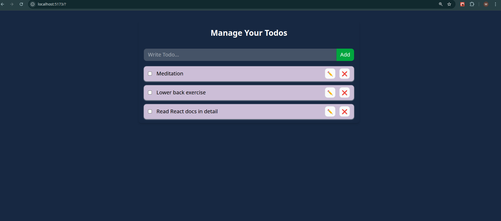
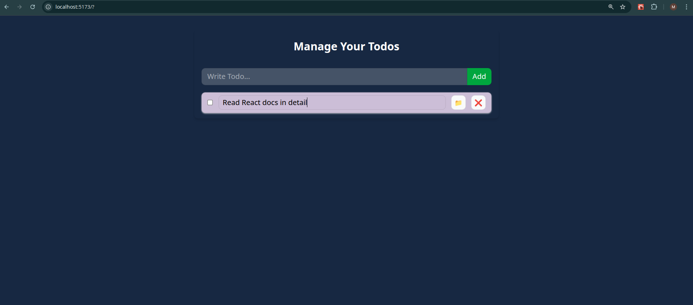
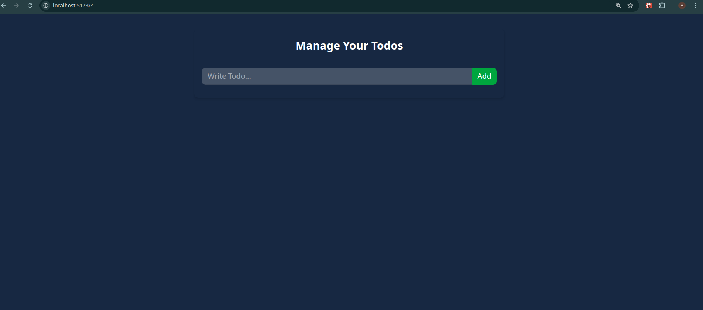

# React Todo App with Local Storage 📝

A robust Task Management application built with React and Tailwind CSS. This project serves as a comprehensive guide to combining **Global State Management** (Context API) with **Data Persistence** (Local Storage) to create a seamless user experience.

## 🚀 Features

- **Full CRUD Operations:**
  - **Create:** Add new tasks with a unique ID.
  - **Read:** View all tasks in a responsive list.
  - **Update:** Edit task text and toggle completion status in real-time.
  - **Delete:** Remove tasks efficiently from the list.
- **Data Persistence:** Automatically syncs todos with the browser's `localStorage`, ensuring data survives page reloads.
- **Global Context:** Manages the application state (todos array, add, delete, update functions) globally, avoiding prop drilling.
- **Functional Updates:** Uses safe state update patterns to ensure data consistency.

## 🛠️ Tech Stack

- **Library:** React JS
- **State Management:** Context API
- **Styling:** Tailwind CSS
- **Storage:** Browser Local Storage
- **Build Tool:** Vite

## 🧠 Concepts & Hooks Used

This project was built to master the synchronization of React State with external systems. Here is how the core concepts are applied:

- **`createContext`**: Defines the "shape" of our context (todos array and function placeholders) to provide auto-completion and type safety across the app.
- **`useContext`**: Used by the `TodoForm` and `TodoItem` components to access and modify the global state without passing props through intermediate parents.
- **`useEffect` (Loading)**: Runs once on mount (`[]`) to parse `localStorage` data (`JSON.parse`) and load it into the React state.
- **`useEffect` (Saving)**: Runs every time the `todos` dependency changes (`[todos]`) to stringify the array (`JSON.stringify`) and save it back to `localStorage`.
- **Functional State Updates**: Uses the callback pattern in `setTodos` (e.g., `prev => [...]`) to guarantee we are always working with the most current state snapshot, preventing race conditions.
- **`map` & `filter`**:
  - `map`: Used in `updateTodo` to traverse the array and conditionally swap a specific todo item while keeping others intact.
  - `filter`: Used in `deleteTodo` to return a new array that excludes the specific ID.
- **Spread Operator (`...`)**: extensively used to copy existing properties of a todo object while overriding specific fields (like `completed: !prev.completed`).

## 🖥️ Screenshots

**Active Tasks View**


**Editing Mode**


**Empty State**


## 💻 How to Run Locally

1. **Clone the repository**
   ```bash
   git clone [https://github.com/umersaif11/react-todo-context-local.git](https://github.com/umersaif11/react-todo-context-local.git)
   ```

2. Navigate to the project directory
```bash
   cd react-todo-context-local
```    
3. Start the development server
```bash
   npm run dev
```  
   